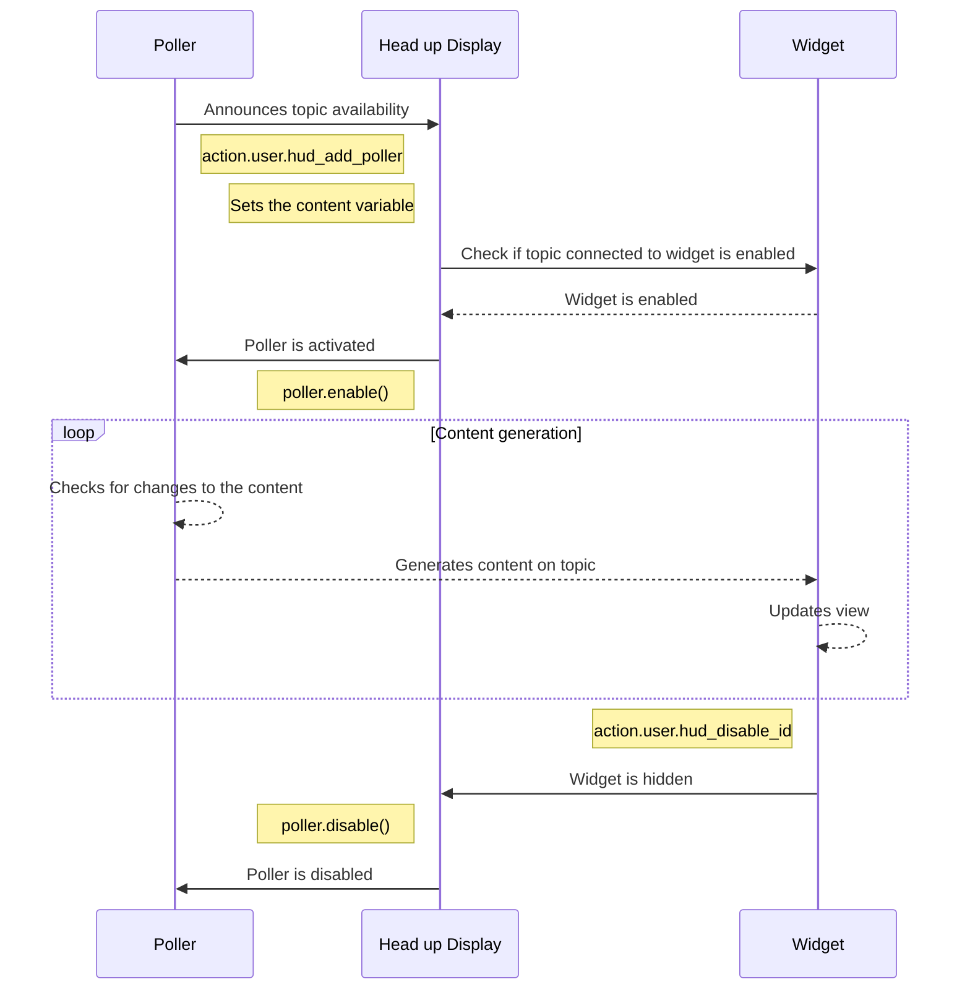

# Talon HUD Content

The content inside of the HUD is meant to be mostly customizable and creatable by you. Stuff like available modes, programming languages and can be tweaked to match your specific needs.  
Creating text content is straight forward and can be done in .talon files for the simple use cases, and in python for the more advanced usecases.  
There is also other content like status bar icons, logs and screen regions, that have special requirements.

For more advanced cases, there is also [sticky content](#sticky-and-changing-content), which is content that can stick around in between restarts. An example of this is the mode or microphone icon on the status bar, but things like the scope debugging are sticky content as well. On the bottom of the page is an explanation on how to make your own sticky content.

## Content customization

### Customizing mode tracking

You can customize three things about the mode tracking
1. The icons connected to the modes. These are stored in the themes folder as <modename>_icon.png and can be changed there.
2. The mode that should be displayed on the status bar.
3. The toggle functionality of the mode tracking button.

Below is an example of the last two being customized, where only the command and sleep icon are displayed, instead of having the dictation icon displayed as well.

```python
from talon import Context, actions, scope

ctx = Context()
ctx.matches = """
tag: user.talon_hud_available
"""

@ctx.action_class("user")
class Actions:

    def hud_determine_mode() -> str:
        """Determine the current mode used for the status bar icons and the widget states"""
        active_modes = scope.get("mode")
        available_modes = ["command", "sleep"]
        
        current_mode = "command"
        for available_mode in available_modes:
            if available_mode in active_modes:
                current_mode = available_mode
                break
        
        return current_mode

    def hud_toggle_mode():
        """Toggle the current mode to a new mode"""
        current_mode = actions.user.hud_determine_mode()
        if current_mode in ["command"]:
             actions.speech.disable()
        elif current_mode == "sleep":
             actions.speech.enable()
```

### Customizing language tracking

You can customize two things about the language tracking
1. The language icons shown in the status bar - These are images with the language names inside of the themes images folder.
2. The action that is executed when you click on the language icon

By default, there is no action tied to the language icon, but you can add one yourself by tweaking the example below.

```python
from talon import Context, actions, scope

ctx = Context()
ctx.matches = """
tag: user.talon_hud_available
"""

@ctx.action_class("user")
class Actions:

    def hud_toggle_language(current_language: str = "en_US"):
        """Toggles the current language to another language"""
        actions.user.hud_add_log("warning", "Clicked the language " + current_language + " icon!")
```

### Customizing programming languages

In the programming language visualisation, you can change a couple of things:

1. The available programming languages - These are kept in preferences/programming_languages.csv.
- The first column is the programming language.
- The second column is the extension, this will be shown as text if no icon is available.
- The icon file name of the programming language.
2. The programming language icons - These are kept in the images folder inside themes.
3. The language detection code
4. The toggle functionality of the icon

An example of the last two where only the tags and not the modes are referenced for the language are kept down below.
Also, in this example, clicking on the programming language makes the language show up in the event log with a different colour.

```python
from talon import Context, actions, scope

ctx = Context()
ctx.matches = """
tag: user.talon_hud_available
"""

@ctx.action_class("user")
class Actions:
    def hud_can_toggle_programming_language() -> bool:
        """Check if we should be able to toggle the programming language from the status bar"""
        return True

    def hud_toggle_programming_language():
        """Toggle the programming language manually in the status bar"""
        language = actions.user.hud_get_programming_language()
        type = "success" if language == "python" else "error"
        actions.user.hud_add_log(type, "The current language is " + actions.user.hud_get_programming_language())

    def hud_get_programming_language() -> str:
        """Get the programming language to be displayed in the status bar - By default tries to mimic knausj"""
        lang = actions.code.language()
        if not lang:
            languages = actions.user.hud_get_available_languages()
            active_tags = scope.get("tag")
            if (active_tags is not None):
                for index, active_tag in enumerate(active_tags):
                    if (active_tag.replace("user.", "") in languages.keys()):
                        return active_tag.replace("user.", "")
            return ""
        else:
            return lang if lang else ""
```

## Creating text content

Publishing to a single text panel is easy and can be done either through a .talon file, or in a python file
An example where a simple hello world text is published is placed below. `hello world talon` is purely inside a talon file, `hello world python` is a connection between the .talon file and the python file.

```talon
hello world talon: user.hud_publish_content("Hello world example", "example", "Hello world")
hello world python: user.hud_example_text()
```

```python
from talon import Module, actions

mod = Module()
@mod.action_class
class Actions:
    
	def hud_example_text():
	    """This is an example action for HUD documentation purposes"""
		actions.user.hud_publish_content("Hello world example", "example", "Hello world")
```

You can also place rich text inside of the content.

These will apply styling to the text within them. Rich text needs to be opened with a style marker and closed with a closing marker.  
Bold and italic markers can be active at the same time. For the colours, only the latest will count.

In order to create text like this: 
I want to **try out** rich text!

You have to type this:
``` 
'I want to <*try out/> rich text!
``` 

The following styling markers are available:
- <* : Bold text
- </ : Italic text
- <+ : Text in the colour green, used for success messages and other successful actions
- <! : Text in the colour orange, used for warning users
- <!! : Text in the colour red, used for errors
- <@ : Text in the colour blue, used to notify the user.
- <cmd@ : Denotes the start of a voice command that can be said - Not all widgets have a specific style for this
- /> : Closing marking - ends the latest style applied

When writing rich text containing voice commands, make sure to emphasise the voice commands with one of these markers so they stand out from the rest of the text.  
This makes it easier for the user to quickly pick out the voice commands from the text you have written.  
There isn't a firm styling for voice commands yet, so for now just apply a bold marker at the minimum until we maybe decide on one.

### Publishing documentation

In order to make your content more discoverable for other users, you can place it in the documentation portion of the Talon HUD.  
For this, you need a documentation loader file, and a set of files to load in. An example of a documentation loader file that loads in a file inside of a folder as documentation can be seen below.  

```python
from talon import scope, app, actions
import os

# Get the absolute path to the documentation directory for your package
documentation_dir = str(os.path.dirname(os.path.abspath(__file__)))

def talon_hud_ready():
    # Check if Talon HUD is available to the user
    MINIMUM_TALON_HUD_RELEASE = 6
    if "user.talon_hud_available" in scope.get("tag") and \
        scope.get("user.talon_hud_version") != None and scope.get("user.talon_hud_version") >= MINIMUM_TALON_HUD_RELEASE:
        actions.user.hud_add_documentation("Example text", 
            "gives a short description of your available documentation.",
            documentation_dir + "/example.txt")

app.register("ready", talon_hud_ready)
```

When you are drafting documentation, it is advised to turn on the development mode of the Talon HUD, this will make the content reload as you update the documentation file.
Turn it on using `head up development start`, and when you are done again, turn it off with `head up development stop`.

### Publishing walkthroughs

Walkthroughs are a set by step guide through a process, that you can create yourself as well. Just like publishing documentation above, you need to set up a loader that can load in the walkthrough file into the HUD.
An example of a walkthrough loader that loads in a single .json file that expands upon the documentation loader above is given below.

```python
...
    MINIMUM_TALON_HUD_RELEASE = 6
    if "user.talon_hud_available" in scope.get("tag") and \
        scope.get("user.talon_hud_version") != None and scope.get("user.talon_hud_version") >= MINIMUM_TALON_HUD_RELEASE:
            # Media usage
            actions.user.hud_add_walkthrough("Example walkthrough", 
                documentation_dir + "/example walkthrough.json")

...
```

A walkthrough file can either be a .json file, which allows you to add contextual hints as well, or a markdown file, which does not have any context hints.

The .JSON file format is shown below, where the text 'Please turn on command mode' is shown if you do not have command mode turned on. The walkthrough also has a single voice command, `head up hide status bar`, inside of it.

```json
[
    {
	    "content": "This is an example walkthrough step! Say <cmd@head up hide status bar/> to continue!",
		"modes": ["command"],
		"tags": [],
		"context_hint": "Please turn on command mode"
	}
]
```

When you are designing walkthroughs, it is advised to turn on the development mode of the Talon HUD, this will make the content reload as you update the walkthrough file.
Turn it on using `head up development start`, and when you are done again, turn it off with `head up development stop`.

For more advanced usecases you can programmatically add a walkthrough as well with the actions `user.hud_create_walkthrough_step` and `user.hud_create_walkthrough` available in content/walkthrough.py.

### Markdown(.MD) support

Both for documentation and for walkthroughs, a subset of the markdown file format is supported.

The current support allows:
- Bolding
- Italizing
- Quoting with backticks

Notable things that aren't supported are:
- Headings
- Horizontal lines
- Links
- Images
- Advanced markdown ad ons like tables, flowcharts

The markdown file format is automatically detected when a file with .md is loaded in.

In walkthroughs, every new line starts a new walkthrough step.

## Non-text content

This is still being fleshed out, but in the mean time, you can take a look at the [previous content documentation](docs/deprecated_docs/CONTENT_README.md)

## Sticky and changing content

Publishing or tweaking content is fine, but you can make content that changes dynamically as well, or that starts up after a restart.
For this, we need to bring in a couple of concepts: Topics and pollers.

A diagram is shown below of the general system when a poller is added to the HUD and content gets sent to the widget automatically when Talon has fully started.



### Topics

The HUD has a content broadcast system. This roughly means that you as the broadcaster do not directly decide which widget is chosen for the content that you display on the HUD. The HUD needs to assign a widget to the content given to it, and this assigning process is done using topics and topic types.

For instance, there are multiple text widgets in the HUD, the text panel and the documentation panel. The reason content shows up in the documentation panel rather than the text panel is because of the topic assigned to the content. The "documentation" topic specifically shows up on the documentation panel, whereas other topics show up on the text panel instead.  
In the future, I am planning to make it possible that users can create new instances of widgets like text panels on the fly using voice commands, and can choose to apply topics to that widget. This way multiple types of dynamic content can be shown on the screen exactly as the user wants it. Currently this can be done by editing the default widgets in the widget_manager.py file.

Topic types are the categories of topics that widgets can consume. For instance, "status_icons" is used for icons on the status bar.
Currently these are the content types available with their widgets:
- status_icons : Icons showing up on the status bar
- status_options : Right click options showing up when right clicking the status bar
- ability_icons : Icons showing up on the ability bar
- log_messages : Messages showing up on the event log
- text : Textual content
- choice : Single or multiple choice content that the user must decide on
- walkthrough_step : Content displaying on the walkthrough widget
- cursor_regions : Regions of the screen used to decide which icon should be displayed next to the mouse cursor
- screen_regions : Regions of the screen used to decide where to render what type of non-clickable content
- variables : Content that gets broadcast to every widget, used for instance to update whether or not sleep mode is turned on.

Using the topic type and topic system, it is possible to make multiple status bars, or multiple event logs, and have the content directed to the widget where the user wants it.  
Topics are linked to widgets and persisted as the user wants it, this makes it possible to turn on specific content after a restart, which brings us to "Pollers".

### Pollers

Pollers are simple classes that you can register into the HUD system which gives you a bunch of hooks to play with.  
Once the HUD decides that a poller should be enabled, it will call the enable method to ask the Poller to start generating content. If the HUD decides that the polled content no longer has a target widget, it will call the disable method on the poller to allow you to stop generating the dynamic content. This system allows for the minimal amount of content generation going on at the same time.

Because pollers are registered using topics, the enabling and disabling process can happen during multiple events.
- When Talon restarts, the HUD enables all pollers of all shown widgets' topics.
- When poller content is broadcast, but no widget accepts the topic, the poller is disabled.
- When a widget is hidden, the HUD disables the pollers connected to that widgets topics.
- When a widget is shown, the HUD enables all the pollers connected to that widgets topics.
- When new content is broadcast with 'claim' turned on, it will connect to the widget and disable other pollers connected to that topic type.
- When a Talon HUD environment changes, all new topics are enabled and all old topics that aren't available in the new environment are disabled.
- When the poller python file is updated, the old poller is disabled and the new poller is enabled.

On top of that, when a poller becomes active because a user has requested it's content, the assigned widget can be made active as well. This happens for instance when you open the scope debugging with 'toolkit scope'.

The combination of the pollers and topics as a system allow the following functionality:
- Users can decide where the content is displayed
- Users can set up the content once, and it will stick around after restarts
- Users enjoy no needless events being listened and responded to when the content is not displayed
- Scripters do not need to think of all of the possibilities listed above, as it is done for them.

Because pollers can be activated during all kinds of dynamic flows however, you should rely on the methods found in the HudContentBuilder ( content/content_builder.py ) that is set on the content variable on the poller.
It is also recommended to not to change the context ( like adding/removing tags, changing talon lists etc ) to make sure that a user cannot accidentally create a context loop.

*Note: You can set pollers to be always active as well. However, this is discouraged for most content. 
Only if content or information should be gathered when the HUD isn't active should this be used done.
An example of this is in content/mode_poller.py, where the current mode needs to be known even if some of the widgets are disabled.*

We will make an example poller below to put these idea's into practice, so you can think of ways to make your own.

### Example poller

Let's say we want to create a visual counter on the HUD status bar that counts how long the HUD is visible.
For this, we will need to create a python file, and a talon file for a voice command to activate the counting.

The talon file looks like this:

```talon
-
start counting: user.start_counting()
pause counting: user.pause_counting()
stop counting: user.stop_counting()
```

It simply allows for the starting and pausing of the counting process, and the alltogether stopping. Below is an example with comments on how the python poller looks like

```py
from talon import actions, cron, app, Module

# Starts counting whenever it is enabled
class CountingPoller:
    enabled = False
    content = None
    counting_job = None
    current_count = 0
    topic = "counting"

    def enable(self):
        if not self.enabled:
            self.enabled = True
            self.publish_count() # Immediately publish the current count to the HUD
            self.counting_job = cron.interval("1s", self.count_up) # Increase the count every second
    
    def disable(self):
        if self.enabled:
            self.enabled = False
            # Clean up all the counting related crons/ registered events
            cron.cancel(self.counting_job)

    def count_up(self):
        self.current_count += 1
        self.publish_count()

    def publish_count(self):
        topic = self.topic # The topic to publish
        topic_type = "status_icons" # The type of topic to publish
        icon = None # The status bar icon, in this case, we do not want any
        text = str(self.current_count) # The text to display in the status bar
        accessible_text = text + " is the current count" # Accessible text that can in the future be used for screen readers
        status_icon = self.content.create_status_icon(topic, icon, text, accessible_text )
        self.content.publish_event("status_icons", self.topic, "replace", status_icon)

    # Disable the counting on the status bar completely
    # As the topic is removed from the widget, the poller won't restart when the widget is enabled again
    def disable_counting(self):
        self.disable()
        self.current_count = 0
        
        # Remove the topic and the content from the status bar
        self.content.publish_event("status_icons", self.topic, "remove")

# Create a single poller that we can use in action definitions below
counting_poller = CountingPoller()

# Register the poller to the HUD whenever the file is reloaded
def append_poller():
    actions.user.hud_add_poller(counting_poller.topic, counting_poller)
app.register("ready", append_poller)

# Add actions to bind in a .talon file
mod = Module()
@mod.action_class
class Action:

    def start_counting():
        """Starts counting on the Talon HUD status bar"""
        global counting_poller
        actions.user.hud_activate_poller(counting_poller.topic)

    def pause_counting():
        """Pauses the counting on the Talon HUD status bar"""
        global counting_poller
        actions.user.hud_deactivate_poller(counting_poller.topic)
        
    def stop_counting():
        """Removes the counting from the Talon HUD status bar"""
        global counting_poller
        counting_poller.disable_counting()
```