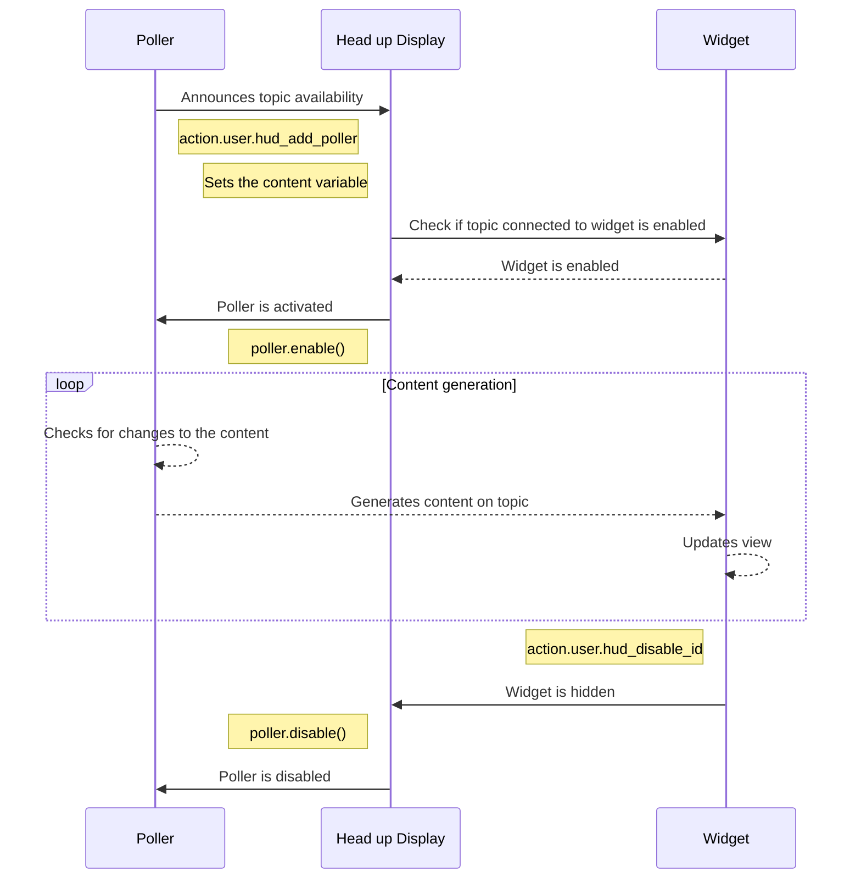

# Talon HUD Content

The content inside of the HUD is meant to be mostly customizable and creatable by you. Stuff like available modes, programming languages and can be tweaked to match your specific needs.  
Creating text content is straight forward and can be done in .talon files for the simple use cases, and in python for the more advanced usecases.  
There is also other content like status bar icons, logs and screen regions, that have special requirements.

For more advanced cases, there is also [sticky content](#sticky-and-changing-content), which is content that can stick around in between restarts. An example of this is the mode or microphone icon on the status bar, but things like the scope debugging are sticky content as well. On the bottom of the page is an explanation on how to make your own sticky content.

## Content customization

### Customizing mode tracking

You can customize three things about the mode tracking
1. The icons connected to the modes. These are stored in the themes folder as <modename>_icon.png and can be changed there.
2. The mode that should be displayed on the status bar.
3. The toggle functionality of the mode tracking button.
4. The available modes to detect, by overriding the **user.hud_get_status_modes** action.

Below is an example of the last two being customized, where only the command and sleep icon are displayed, instead of having the dictation icon displayed as well.

```python
from talon import Context, actions, scope

ctx = Context()
ctx.matches = """
tag: user.talon_hud_available
"""

@ctx.action_class("user")
class Actions:

    def hud_determine_mode() -> str:
        """Determine the current mode used for the status bar icons and the widget states"""
        active_modes = scope.get("mode")
        available_modes = ["command", "sleep"]
        
        current_mode = "command"
        for available_mode in available_modes:
            if available_mode in active_modes:
                current_mode = available_mode
                break
        
        return current_mode

    def hud_toggle_mode():
        """Toggle the current mode to a new mode"""
        current_mode = actions.user.hud_determine_mode()
        if current_mode in ["command"]:
             actions.speech.disable()
        elif current_mode == "sleep":
             actions.speech.enable()
```

By overriding the **hud_get_status_modes** and adding more modes than just the dictation, command and sleep mode, you can add more theming possibilities as well. An example can be found in the content/mode_poller.py file.
For instance, if you had a gaming mode, and you have **user.gaming** added to the **hud_get_status_modes** result, you can have an audio cue be played ( user.gaming_mode.wav ) and have an icon loaded in ( user.gaming_icon.png ) onto your status bar as well.

### Customizing language tracking

You can customize two things about the language tracking
1. The language icons shown in the status bar - These are images with the language names inside of the themes images folder.
2. The action that is executed when you click on the language icon

By default, there is no action tied to the language icon, but you can add one yourself by tweaking the example below.

```python
from talon import Context, actions, scope

ctx = Context()
ctx.matches = """
tag: user.talon_hud_available
"""

@ctx.action_class("user")
class Actions:

    def hud_toggle_language(current_language: str = "en_US"):
        """Toggles the current language to another language"""
        actions.user.hud_add_log("warning", "Clicked the language " + current_language + " icon!")
```

### Customizing programming languages

In the programming language visualisation, you can change a couple of things:

1. The available programming languages - These are kept in preferences/programming_languages.csv.
- The first column is the programming language.
- The second column is the extension, this will be shown as text if no icon is available.
- The icon file name of the programming language.
2. The programming language icons - These are kept in the images folder inside themes.
3. The language detection code
4. The toggle functionality of the icon

An example of the last two where only the tags and not the modes are referenced for the language are kept down below.
Also, in this example, clicking on the programming language makes the language show up in the event log with a different colour.

```python
from talon import Context, actions, scope

ctx = Context()
ctx.matches = """
tag: user.talon_hud_available
"""

@ctx.action_class("user")
class Actions:
    def hud_can_toggle_programming_language() -> bool:
        """Check if we should be able to toggle the programming language from the status bar"""
        return True

    def hud_toggle_programming_language():
        """Toggle the programming language manually in the status bar"""
        language = actions.user.hud_get_programming_language()
        type = "success" if language == "python" else "error"
        actions.user.hud_add_log(type, "The current language is " + actions.user.hud_get_programming_language())

    def hud_get_programming_language() -> str:
        """Get the programming language to be displayed in the status bar - By default tries to mimic knausj"""
        lang = actions.code.language()
        if not lang:
            languages = actions.user.hud_get_available_languages()
            active_tags = scope.get("tag")
            if (active_tags is not None):
                for index, active_tag in enumerate(active_tags):
                    if (active_tag.replace("user.", "") in languages.keys()):
                        return active_tag.replace("user.", "")
            return ""
        else:
            return lang if lang else ""
```

### Customizing syllable cues

Because syllable cues can be quite intrusive, it makes sense to turn them off for some work flows. For instance when the sleep mode is turned on and you do not expect the commands to do anything, or during dictation mode when you are reviewing your words constantly anyway.  
To achieve this, you can change the setting `user.talon_hud_syllable_cues` to 0 to turn it off, or to 1 to turn it on.

By default, it is turned off for sleep and dictation mode, as can be seen in hud_syllable_cue_settings.talon

```talon
mode: sleep
mode: dictation
-
settings():
    user.talon_hud_syllable_cues = 0
```

## Creating text content

Publishing to a single text panel is easy and can be done either through a .talon file, or in a python file
An example where a simple hello world text is published is placed below. `hello world talon` is purely inside a talon file, `hello world python` is a connection between the .talon file and the python file.

```talon
hello world talon: user.hud_publish_content("Hello world example", "example", "Hello world")
hello world python: user.hud_example_text()
```

```python
from talon import Module, actions

mod = Module()
@mod.action_class
class Actions:
    
	def hud_example_text():
	    """This is an example action for HUD documentation purposes"""
		actions.user.hud_publish_content("Hello world example", "example", "Hello world")
```

You can also place rich text inside of the content.

These will apply styling to the text within them. Rich text needs to be opened with a style marker and closed with a closing marker.  
Bold and italic markers can be active at the same time. For the colours, only the latest will count.

In order to create text like this: 
I want to **try out** rich text!

You have to type this:
``` 
'I want to <*try out/> rich text!
``` 

The following styling markers are available:
- <* : Bold text
- </ : Italic text
- <+ : Text in the colour green, used for success messages and other successful actions
- <! : Text in the colour orange, used for warning users
- <!! : Text in the colour red, used for errors
- <@ : Text in the colour blue, used to notify the user.
- <cmd@ : Denotes the start of a voice command that can be said - Not all widgets have a specific style for this
- /> : Closing marking - ends the latest style applied

When writing rich text containing voice commands, make sure to emphasise the voice commands with one of these markers so they stand out from the rest of the text.  
This makes it easier for the user to quickly pick out the voice commands from the text you have written.  
There isn't a firm styling for voice commands yet, so for now just apply a bold marker at the minimum until we maybe decide on one.

### Publishing documentation

In order to make your content more discoverable for other users, you can place it in the documentation portion of the Talon HUD.  
For this, you need a documentation loader file, and a set of files to load in. An example of a documentation loader file that loads in a file inside of a folder as documentation can be seen below.  

```python
from talon import scope, app, actions
import os

# Get the absolute path to the documentation directory for your package
documentation_dir = str(os.path.dirname(os.path.abspath(__file__)))

def talon_hud_ready():
    # Check if Talon HUD is available to the user
    MINIMUM_TALON_HUD_RELEASE = 6
    if "user.talon_hud_available" in scope.get("tag") and \
        scope.get("user.talon_hud_version") != None and scope.get("user.talon_hud_version") >= MINIMUM_TALON_HUD_RELEASE:
        actions.user.hud_add_documentation("Example text", 
            "gives a short description of your available documentation.",
            documentation_dir + "/example.txt")

app.register("ready", talon_hud_ready)
```

When you are drafting documentation, it is advised to turn on the development mode of the Talon HUD, this will make the content reload as you update the documentation file.
Turn it on using `head up development start`, and when you are done again, turn it off with `head up development stop`.

### Publishing walkthroughs

Walkthroughs are a set by step guide through a process, that you can create yourself as well. Just like publishing documentation above, you need to set up a loader that can load in the walkthrough file into the HUD.
An example of a walkthrough loader that loads in a single .json file that expands upon the documentation loader above is given below.

```python
...
    MINIMUM_TALON_HUD_RELEASE = 6
    if "user.talon_hud_available" in scope.get("tag") and \
        scope.get("user.talon_hud_version") != None and scope.get("user.talon_hud_version") >= MINIMUM_TALON_HUD_RELEASE:
            # Media usage
            actions.user.hud_add_walkthrough("Example walkthrough", 
                documentation_dir + "/example walkthrough.json")

...
```

A walkthrough file can either be a .json file, which allows you to add contextual hints as well, or a markdown file, which does not have any context hints.

The .JSON file format is shown below, where the text 'Please turn on command mode' is shown if you do not have command mode turned on. The walkthrough also has a single voice command, `head up hide status bar`, inside of it.

```json
[
    {
	    "content": "This is an example walkthrough step! Say <cmd@head up hide status bar/> to continue!",
		"modes": ["command"],
		"tags": [],
		"context_hint": "Please turn on command mode"
	}
]
```

When you are designing walkthroughs, it is advised to turn on the development mode of the Talon HUD, this will make the content reload as you update the walkthrough file.
Turn it on using `head up development start`, and when you are done again, turn it off with `head up development stop`.

For more advanced usecases you can programmatically add a walkthrough as well with the actions `user.hud_create_walkthrough_step` and `user.hud_create_walkthrough` available in content/walkthrough.py.

### Markdown(.MD) support

Both for documentation and for walkthroughs, a subset of the markdown file format is supported.

The current support allows:
- Bolding
- Italizing
- Quoting with backticks

Notable things that aren't supported are:
- Headings
- Horizontal lines
- Links
- Images
- Advanced markdown ad ons like tables, flowcharts

The markdown file format is automatically detected when a file with .md is loaded in.

In walkthroughs, every new line starts a new walkthrough step.

## Log messages

If you want to add a log message after something happens, for example copying content, you can use the action `user.hud_add_log`. 
For example, `user.hud_add_log('warning', '<*Note:/> This is a warning message!')` will add an orange message with "**Note:** This is a warning message!" as the text.

The first argument is the type of log message, and the second is the message you want to display. 
There are five types of log message stylings:
- command: This is the regular non-styled message
- event: Blue background
- warning: Orange background
- error: Red background
- success: Green background

The message can contain bold and italic markers like explained in the [Creating text content](#creating-text-content) section, but no colours.

## Status icons

- Status bar icons
- Ability icons


This is still being fleshed out, but in the mean time, you can take a look at the [previous content documentation](docs/deprecated_docs/CONTENT_README.md)

## Eyetracker content

There are a set of widgets that are designed specifically to work well with eyetracker usage. The cursor tracker and the screen overlay. 
The cursor tracker displays an icon next to the cursor, which translates coarsely to where you are looking when you are using an eyetracker.
Similarly, the screen overlay widget allows you to mark specific regions with an icon, colour and text. 
While on their own, they do not offer ready to use content like the status bar does, there are ways to create content for them which can enhance the usage of eyetrackers in combination with, for example, noises.  

### Activatable virtual keys

The virtual keyboard and the dwell toolbar offer a way to interact with regions on the screen without it requiring a click. The activation trigger can be a voice command, a noise or any other user input like a footswitch or a keyboard key.
Both of these go about activating the actions connected to regions in their own unique way. The virtual keyboard requires an activation trigger to activate, whereas the dwell toolbar requires you to look at the region, and then stores the result to be used by an activation trigger later.

You can make a key for both of these tools using the action `user.hud_create_virtual_key`. This action takes these arguments:
- action: The action to activate. This can either be a function or a string, where the string will be converted to a key press
- text: Optional, The text to display when hovered over the region
- icon: Optional, the image to display when hovered over the region. In the case of a dwell toolbar, the icon that is kept next to your mouse cursor.
- colour: Optional, the colour of the region. In the case of a dwell toolbar, the colour that is kept next to your mouse cursor.
- text_colour: Optional, the text colour of the displayed title.
- x: Optional, the X coordinate of the topleft position of the key.
- y: Optional, the Y coordinate of the topleft position of the key.
- width: Optional, the width of the key.
- height: Optional, the height of the key.

If no colours are given, they will be assigned according to a colour blind template.

Once you have a bunch of virtual keys, you can assign them to either a virtual keyboard or a dwell toolbar.

They both use layouts to spread the available triggers out across a grid layout, the available layout options are listed below. 
- The full grid covers the entire screen.
- The open grid goes around the center of the screen, covering all the sides but keeping the center free from regions.

You can also choose an aligment which determines the order of the placement.

Below is an example of each grid layout, where we have 12 virtual keys, and where the dots represent no screen regions.

```
No regions     Full grid default
. . . .        1 2 3 4  
. . . .        5 6 7 8  
. . . .        9 A B C  

Left aligned   Open grid
1 4 7 A        1 2 3 4
2 5 8 B        5 B C 7
3 6 9 C        6 9 A 8
```

By default the virtual keyboard covers the entire screen using the full grid layout, while the dwell toolbar uses a left aligned grid. 
They dynamically grow depending on the amount of virtual keys available, but they can be set according to your desired horizontal and vertical amount.

### Virtual keyboard

To register a virtual keyboard, you can use the `user.hud_register_virtual_keyboard` action, which takes the following arguments:
- name: The name of the virtual keyboard
- keys: A list of the virtual keys
- layout_style: The grid layout of the keys: 'full', 'aligned' or 'open', explained above. 'full' by default
- alignment: The alignment, either left, right, top or bottom. left by default
- horizontal_key_amount: Amount of horizontal key regions, 3 by default
- vertical_key_amount: Amount of vertical key regions, 3 by default

You can then visualise the virtual keyboard by using the `user.hud_set_virtual_keyboard` action. Which takes the following arguments.
- name: The name of the virtual keyboard to visualise - If the name wasn't found, the virtual keyboard will be made invisible. Default empty
- monitor: The monitor number to show the virtual keyboard on, default 0 for primary monitor

If you wish to activate a virtual key, use the `user.hud_activate_virtual_key` which activates the virtual key the mouse is currently over.

An example is shown below where we have a virtual keyboard which can type 1 through 9. We activate it by saying `show virtual keys`, then saying `key this` to type the number. We can hide the keyboard by saying `hide virtual keys`.

```talon
-
show virtual keys: user.hud_set_virtual_keyboard('example_keyboard')
hide virtual keys: user.hud_set_virtual_keyboard()
key this: user.hud_activate_virtual_key()
```

```python
from talon import actions, app

def register_keyboard():
    keys = [
	    actions.user.hud_create_virtual_key('1', 'One'),
	    actions.user.hud_create_virtual_key('2', 'Two'),
	    actions.user.hud_create_virtual_key('3', 'Three'),
	    actions.user.hud_create_virtual_key('4', 'Four'),
	    actions.user.hud_create_virtual_key('5', 'Five'),
	    actions.user.hud_create_virtual_key('6', 'Six'),
	    actions.user.hud_create_virtual_key('7', 'Seven'),
	    actions.user.hud_create_virtual_key('8', 'Eight'),
	    actions.user.hud_create_virtual_key('9', 'Nine')
	]
	actions.user.hud_register_virtual_keyboard('example_keyboard', keys)

app.register('ready', register_keyboard)
```

### Dwell toolbar

To register a dwell toolbar, you can use the `user.hud_register_dwell_toolbar` action, which takes the following arguments:
- name: The name of the dwell toolbar
- keys: A list of the virtual keys
- dwell_ms: The amount of milliseconds until a dwell key gets saved and moves around with your cursor tracker. By default this is set to 750ms.
- layout_style: The grid layout of the keys: 'full', 'aligned' or 'open', explained above. 'aligned' by default
- alignment: The alignment, either left, right, top or bottom. left by default
- horizontal_key_amount: Amount of horizontal key regions, 3 by default
- vertical_key_amount: Amount of vertical key regions, 5 by default

You can then visualise the dwell toolbar by using the `user.hud_set_dwell_toolbar` action. Which takes the following arguments.
- name: The name of the dwell toolbar to visualise - If the name wasn't found, the dwell toolbar will be made invisible and the active dwell icon will be cleared. Default empty
- monitor: The monitor number to show the virtual keyboard on, default 0 for primary monitor

Once you have a dwell toolbar visible, we can hover over each region and have the assigned action saved over to our cursor. Once the colour is moved over, you know that the action has been assigned. 
When this is done, you can activate the saved dwell action using `user.hud_activate_dwell_key`. If you wish to clear the current dwell action, use `user.hud_deactivate_dwell_key`.

A set of example files is shown below, where the you can type A, B, C, D and E with the dwell action. We activate the dwell toolbar by saying `show dwell toolbar`, and activate a dwell using `dwell this`. We can hide it again with `hide dwell toolbar`. We can clear the dwell action with `clear dwell`.

```talon
-
show dwell toolbar: user.hud_set_dwell_toolbar('example_toolbar')
hide dwell toolbar: user.hud_set_dwell_toolbar()
dwell this: user.hud_activate_dwell_key()
clear dwell: user.hud_deactivate_dwell_key()
```

```python
from talon import actions, app

def register_dwell_toolbar():
    keys = [
	    actions.user.hud_create_virtual_key('shift-a', 'A'),
	    actions.user.hud_create_virtual_key('shift-b', 'B'),
	    actions.user.hud_create_virtual_key('shift-c', 'C'),
	    actions.user.hud_create_virtual_key('shift-d', 'D'),
	    actions.user.hud_create_virtual_key('shift-e', 'E')
	]
	actions.user.hud_register_dwell_toolbar('example_toolbar', keys)

app.register('ready', register_dwell_toolbar)
```

### Particle visualisation

You can make a temporary particle appear for a brief moment to indicate that an action has occurred.  
For this, you can use either of the following actions: `user.hud_publish_mouse_particle` or `user.hud_publish_particle`

Both of these take at least four arguments:
- type: This is the type of particle animation that should be used. Currently only 'float_up' is available
- colour: The colour of the particle
- image: An optional image path
- diameter: The size of the particle in pixels

The `user.hud_publish_mouse_particle` action will place the particle where the current mouse position is, whereas with `user.hud_publish_particle` you will have to add the X and Y positions as the fifth and sixth argument.

For example, this .talon file example will show a red particle near your mouse cursor when you say `red particle`, and a blue particle at the top left part of the screen when you say `blue particle`.

```talon
-
red particle: user.hud_publish_mouse_particle('float_up', 'FF0000')
blue particle: user.hud_publish_particle('float_up', '0000FF', '', 10, 100, 100)
```

### Screen regions

The basic building blocks of this eyetracker focused content is the screen region, both the cursor tracker and the screen overlay use this basic building block. 

Screen regions can be created with the `user.hud_create_screen_region` action, and can be published with the `user.hud_publish_screen_regions` action.

The `user.hud_create_screen_region` takes in 11 possible arguments:
- topic: The topic of the screen region, used in for instance clearing away a specific topic
- colour: The colour of the region visualisation
- icon: Optional, The image of the region visualisation
- title: Optional, The text displayed on the region visualisation (Screen overlay only)
- hover_visibility: Optional, Determines the visibility based on hover (Screen overlay only)  
  0 makes the region visible regardless of the cursor position
  1 makes only makes the region visible if the cursor is inside of the region
  -1 makes the region visible, but if the cursor is directly over the visualisation, the visualisation disappears ( for reading behind content for instance )
- x: The X coordinate of the regions topleft position
- y: The Y coordinate of the regions topleft position
- width: The width in pixels of the region
- height: The height in pixels of the region
- relative_x: How many X pixels the regions visualisation should deviate from the normal position, default 0 (Screen overlay only)
- relative_y: How many Y pixels the regions visualisation should deviate from the normal position, default 0 (Screen overlay only)

The `user.hud_publish_screen_regions` takes three arguments:
- type: The type of region we are publishing, either 'cursor' or 'screen'
- regions: A list of created screen regions that should be displayed
- clear: Optional, if set to 1 it will clear away the previous regions from the same topic, otherwise it will just add to the existing ones

If you need to clear away specific screen regions, you can use the `user.hud_clear_screen_regions` action, which takes these arguments:
- type: The type of region we are clearing, either 'cursor' or 'screen'
- topic: Optional, if given only this topic will be cleared, otherwise all regions will be cleared of the given type

Below is an example talon and python file which show various different screen region options. 
After that, there is an explanation of the rules of each specific screen region content.

Try and say the talon commands below and see what they do.

```talon
-
yellow cursor: user.add_yellow_cursor()
red cursor: user.add_red_cursor()
split cursor: user.add_split_cursor_regions()
show example regions: user.add_example_screen_regions()
clear regions: user.clear_screen_regions()
```

```python
from talon import Module, actions
mod = Module()

@mod.action_class
class Actions:

    def add_yellow_cursor():
        """Add a yellow icon to the cursor tracker"""
        yellow_cursor = [actions.user.hud_create_screen_region('cursor_example', 'FFF000')]
        actions.user.hud_publish_screen_regions('cursor', yellow_cursor, 1)

    def add_red_cursor():
        """Add a red icon to the cursor tracker"""
        red_cursor = [actions.user.hud_create_screen_region('cursor_example', 'FF0000')]
        actions.user.hud_publish_screen_regions('cursor', red_cursor, 1)

    def add_split_cursor_regions():
        """Shows a red icon when looking at the top of the screen, and a yellow icon otherwise"""
        split_cursors = [
            actions.user.hud_create_screen_region('cursor_example', 'FF0000', '', '', 0, 0, 0, 1920, 100),
            actions.user.hud_create_screen_region('cursor_example', 'FFF000')
        ]
        actions.user.hud_publish_screen_regions('cursor', split_cursors, 1)
        
    def clear_screen_regions():
        """Clear all cursor and screen regions"""
        actions.user.hud_clear_screen_regions('cursor', 'cursor_example')
        actions.user.hud_clear_screen_regions('screen', 'screen_example')

    def add_example_screen_regions():
        """Adds an example view of screen regions"""
        regions = [
            actions.user.hud_create_screen_region('screen_example', 'FF0000', '', 'Always visible', 0, 0, 0, 200, 200),
            actions.user.hud_create_screen_region('screen_example', '00FF00', '', 'Hover only', 1, 0, 200, 200, 200),
            actions.user.hud_create_screen_region('screen_example', '0000FF', '', 'Hover off', -1, 0, 400, 200, 200)
        ]
        regions[0].text_colour = 'FFFFFF'
        regions[0].vertical_centered = False        
        regions[2].text_colour = 'FFFFFF'
        actions.user.hud_publish_screen_regions('screen', regions, 1)
```

The simplest of the screen regions is the cursor tracker regions, which use the type 'cursor' in the `user.hud_publish_screen_regions` action.
Cursor regions are regions of the screen, or all of the screen, where the icon next to your cursor will become visible. You could, for instance, have the cursor icon appear when it is getting close to the top left part of the screen and not show up for all other regions.

The cursor tracker currently only supports one active icon at the same time, and it determines this icon based on how specific the area it is in. If there is a cursor region that envelops the screen, and a region where the area is smaller like for instance the top left part of the screen, it chooses the smallest area that it is currently in to show that specific icon. You can test this out by saying `split cursor` in the examples above and moving the mouse to the top of the screen, and then moving the mouse down.

The other screen regions do not move with the cursor position but stay in a fixed position on the screen. They can, however, become more or less visible depending on what the 'hover_visibility' argument was set.  
The visualisation of this happens in the center of the given region, but can be controlled by the user to be aligned to the left, right. You can also make the regions vertical alignment not centered, by changing the 'vertically_centered' property as shown in 'add_example_screen_regions' above.

Regions can also be given a different text colour ( which by default is black with a white bezel ) like shown in the 'add_example_screen_regions' above.

Saying `show example regions` in the example above will show a red topleft region which is always visible, a green left region which is only fully visible if the cursor is over it, and a blue region below that which is visible if the cursor is in the region, but hides when the cursor is hovered over the visualisaiton.

## Right click options

TODO

## Audio content

Adding audio cues to certain events can be handy, to keep track of things without having to look at a part of the screen. And you might think of something of your own that could use an audio cue, maybe something like a programming language being detected.
To do that, we need to add a register a couple of things to make sure the user can tweak the audio as they see fit: an audio group and an audio cue.

You can do both of these with the actions **user.hud_add_audio_group** and **user.hud_add_audio_cue**. In the below example, we will register a few audio cues with existing files that we can activate with a voice command.

```talon
-
sound the beeps: user.sound_the_beeps()
```

```python
from talon import app, Module, actions
import random

def register_cues():
    # Registers the audio group
    # This is the group that the user can use to either enable beeps or change their volume all at once
    actions.user.hud_add_audio_group("Beeps", "A series of beeps to randomly use", True)
	
    # These are the individual audio cues inside of the Beeps group
    # These can be managed individually as well by the user
    actions.user.hud_add_audio_cue("Beeps", "Beep one", "", "1", True)
    actions.user.hud_add_audio_cue("Beeps", "Beep two", "", "2", True)
    actions.user.hud_add_audio_cue("Beeps", "Beep three", "", "3", True)
    actions.user.hud_add_audio_cue("Beeps", "Beep four", "", "4", True)	

app.register("ready", register_cues)

mod = Module()
@mod.action_class
class Actions:

    def sound_the_beeps():
        """Sound a series of six differently pitched beeps randomly"""
        four_beeps = ["one", "one", "two", "three", "four", "four"]
        random.shuffle(four_beeps)
        for beep in four_beeps:
            actions.user.hud_trigger_audio_cue("Beep " + beep)
```

If you want to add your own audio files, keep in mind they have to be in 16 bit signed .WAV format inside of a theme's audio folder for it to register properly. You can view the created audio groups inside the `toolkit audio` panel. You will see the given descriptions, current volumes and enabled states there as well.  

## Sticky and changing content

Publishing or tweaking content is fine, but you can make content that changes dynamically as well, or that starts up after a restart.
For this, we need to bring in a couple of concepts: Topics and pollers.

A diagram is shown below of the general system when a poller is added to the HUD and content gets sent to the widget automatically when Talon has fully started.



### Topics

The HUD has a content broadcast system. This roughly means that you as the broadcaster do not directly decide which widget is chosen for the content that you display on the HUD. The HUD needs to assign a widget to the content given to it, and this assigning process is done using topics and topic types.

For instance, there are multiple text widgets in the HUD, the text panel and the documentation panel. The reason content shows up in the documentation panel rather than the text panel is because of the topic assigned to the content. The "documentation" topic specifically shows up on the documentation panel, whereas other topics show up on the text panel instead.  
In the future, I am planning to make it possible that users can create new instances of widgets like text panels on the fly using voice commands, and can choose to apply topics to that widget. This way multiple types of dynamic content can be shown on the screen exactly as the user wants it. Currently this can be done by editing the default widgets in the widget_manager.py file.

Topic types are the categories of topics that widgets can consume. For instance, "status_icons" is used for icons on the status bar.
Currently these are the content types available with their widgets:
- status_icons : Icons showing up on the status bar
- status_options : Right click options showing up when right clicking the status bar
- ability_icons : Icons showing up on the ability bar
- log_messages : Messages showing up on the event log
- text : Textual content
- choice : Single or multiple choice content that the user must decide on
- walkthrough_step : Content displaying on the walkthrough widget
- cursor_regions : Regions of the screen used to decide which icon should be displayed next to the mouse cursor
- screen_regions : Regions of the screen used to decide where to render what type of non-clickable content
- variables : Content that gets broadcast to every widget, used for instance to update whether or not sleep mode is turned on.

Using the topic type and topic system, it is possible to make multiple status bars, or multiple event logs, and have the content directed to the widget where the user wants it.  
Topics are linked to widgets and persisted as the user wants it, this makes it possible to turn on specific content after a restart, which brings us to "Pollers".

### Pollers

Pollers are simple classes that you can register into the HUD system which gives you a bunch of hooks to play with.  
Once the HUD decides that a poller should be enabled, it will call the enable method to ask the Poller to start generating content. If the HUD decides that the polled content no longer has a target widget, it will call the disable method on the poller to allow you to stop generating the dynamic content. This system allows for the minimal amount of content generation going on at the same time.

Because pollers are registered using topics, the enabling and disabling process can happen during multiple events.
- When Talon restarts, the HUD enables all pollers of all shown widgets' topics.
- When poller content is broadcast, but no widget accepts the topic, the poller is disabled.
- When a widget is hidden, the HUD disables the pollers connected to that widgets topics.
- When a widget is shown, the HUD enables all the pollers connected to that widgets topics.
- When new content is broadcast with 'claim' turned on, it will connect to the widget and disable other pollers connected to that topic type.
- When a Talon HUD environment changes, all new topics are enabled and all old topics that aren't available in the new environment are disabled.
- When the poller python file is updated, the old poller is disabled and the new poller is enabled.

Pollers can also be connected using audio groups, in that case they follow the enabling and disabling flow of the audio state
- When the audio is enabled, it enables the poller with the audio group as its name
- When an audio group is enabled, it enables the poller with the audio group as its name
- When the audio or group is disabled, it disables the poller with the audio group as its name

On top of that, when a poller becomes active because a user has requested it's content, the assigned widget can be made active as well. This happens for instance when you open the scope debugging with 'toolkit scope'.

The combination of the pollers and topics as a system allow the following functionality:
- Users can decide where the content is displayed
- Users can set up the content once, and it will stick around after restarts
- Users enjoy no needless events being listened and responded to when the content is not displayed
- Scripters do not need to think of all of the possibilities listed above, as it is done for them.

Because pollers can be activated during all kinds of dynamic flows however, you should rely on the methods found in the HudContentBuilder ( content/content_builder.py ) that is set on the content variable on the poller.
It is also recommended to not to change the context ( like adding/removing tags, changing talon lists etc ) to make sure that a user cannot accidentally create a context loop.

*Note: You can set pollers to be always active as well. However, this is discouraged for most content. 
Only if content or information should be gathered when the HUD isn't active should this be used done.
An example of this is in content/mode_poller.py, where the current mode needs to be known even if some of the widgets are disabled.*

We will make an example poller below to put these idea's into practice, so you can think of ways to make your own.

### Example poller

Let's say we want to create a visual counter on the HUD status bar that counts how long the HUD is visible.
For this, we will need to create a python file, and a talon file for a voice command to activate the counting.

The talon file looks like this:

```talon
-
start counting: user.start_counting()
pause counting: user.pause_counting()
stop counting: user.stop_counting()
```

It simply allows for the starting and pausing of the counting process, and the alltogether stopping. Below is an example with comments on how the python poller looks like

```py
from talon import actions, cron, app, Module

# Starts counting whenever it is enabled
class CountingPoller:
    enabled = False
    content = None
    counting_job = None
    current_count = 0
    topic = "counting"

    def enable(self):
        if not self.enabled:
            self.enabled = True
            self.publish_count() # Immediately publish the current count to the HUD
            self.counting_job = cron.interval("1s", self.count_up) # Increase the count every second
    
    def disable(self):
        if self.enabled:
            self.enabled = False
            # Clean up all the counting related crons/ registered events
            cron.cancel(self.counting_job)

    def count_up(self):
        self.current_count += 1
        self.publish_count()

    def publish_count(self):
        topic = self.topic # The topic to publish
        topic_type = "status_icons" # The type of topic to publish
        icon = None # The status bar icon, in this case, we do not want any
        text = str(self.current_count) # The text to display in the status bar
        accessible_text = text + " is the current count" # Accessible text that can in the future be used for screen readers
        status_icon = self.content.create_status_icon(topic, icon, text, accessible_text )
        self.content.publish_event("status_icons", self.topic, "replace", status_icon)

    # Disable the counting on the status bar completely
    # As the topic is removed from the widget, the poller won't restart when the widget is enabled again
    def disable_counting(self):
        self.disable()
        self.current_count = 0
        
        # Remove the topic and the content from the status bar
        self.content.publish_event("status_icons", self.topic, "remove")

# Create a single poller that we can use in action definitions below
counting_poller = CountingPoller()

# Register the poller to the HUD whenever the file is reloaded
def append_poller():
    actions.user.hud_add_poller(counting_poller.topic, counting_poller)
app.register("ready", append_poller)

# Add actions to bind in a .talon file
mod = Module()
@mod.action_class
class Action:

    def start_counting():
        """Starts counting on the Talon HUD status bar"""
        global counting_poller
        actions.user.hud_activate_poller(counting_poller.topic)

    def pause_counting():
        """Pauses the counting on the Talon HUD status bar"""
        global counting_poller
        actions.user.hud_deactivate_poller(counting_poller.topic)
        
    def stop_counting():
        """Removes the counting from the Talon HUD status bar"""
        global counting_poller
        counting_poller.disable_counting()
```